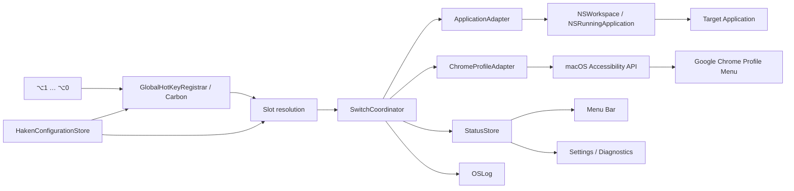

# Haken プロダクト・技術設計書

- ステータス: Proposed
- 更新日: 2026-08-12
- 対象: macOS 15以降、macOSアプリケーション、Google Chrome
- 参考実装: QuickDraw PoC
- 関連資料: [`../PoC/README.md`](../PoC/README.md)

## 先に結論

HakenのMVPは、`⌥1`〜`⌥9`と`⌥0`の10個の固定スロットから、通常アプリまたはChromeプロファイルへ切り替える経路を、Karabiner-Elementsや外部スクリプトなしで完結させる。

> `⌥ + 数字` → Slot → Switch Target → Application AdapterまたはChrome Profile Adapter → 結果表示

アプリはSwift製の常駐macOSアプリとし、Menu Barとネイティブな設定ウィンドウを持つ。QuickDrawで実績のあるアプリ起動、グローバルショートカット監視、設定保存、権限診断、統合ログ、署名付き`.app`の構成を参考にする。一方、QuickDrawのAction Catalogやアプリ別Shortcut配送は持ち込まず、Hakenの中心概念を10個の`Slot`と、そこへ割り当てる型付き`SwitchTarget`に絞る。

通常アプリはbundle identifierを使って標準の起動・activate経路で切り替える。Chromeプロファイルだけは、PoCで確認したAccessibility経路を使う特殊Targetとして扱う。PoCで発生している遅延の主因である`/usr/bin/swift switch-profile.swift`の都度起動を廃止し、常駐プロセス内で切替処理を実行する。Chrome固有のAccessibility構造への依存は`ChromeProfileAdapter`に隔離し、Chrome更新時の修正範囲を限定する。

MVPで最も重要な判断は次のとおり。

1. **入力は`⌥1`〜`⌥0`の10スロットに固定する。** 未割り当てスロットはキーを消費せず、foregroundアプリへそのまま渡す。
2. **各スロットには1つの型付きTargetを割り当てる。** MVPのTargetは`application`と`chromeProfile`の2種類とする。
3. **Karabiner-Elementsに依存しない。** ショートカット登録、実行、必要な権限確認をHaken単体で行う。
4. **通常アプリはmacOS標準API、Chrome ProfileだけはAccessibilityを使う。** 通常アプリ切替だけのユーザーにはAccessibility権限を要求しない。Chrome Profileに`open --profile-directory`は使用しない。
5. **成功判定はTarget種別で分ける。** 通常アプリはfrontmost applicationをbest-effort検証し、Chrome ProfileはAX操作をChromeが受理した時点までとする。
6. **Chrome依存の探索条件をAdapterに閉じ込める。** 更新でAX構造が変わっても、Slot、UI、設定保存へ影響させない。
7. **失敗をユーザー向けの原因と復旧手順へ変換する。** 生の`AXError`や`Chrome menu bar not found.`だけを見せない。

---

## 1. Product definition

### 解決する問題

複数のアプリとChromeプロファイルを行き来するユーザーが、Dock、Command-Tab、マウス操作を使わず、場所として覚えた`⌥ + 数字`で目的の作業コンテキストへ移動できるようにする。

```text
⌥1 → Terminal
⌥2 → Chrome · Work
⌥3 → Slack
⌥4 → Chrome · Personal
…
⌥0 → Music
```

### 提供価値

- よく使うアプリとChromeプロファイルを、同じ10個の場所としてmuscle memoryで呼び出せる。
- 通常アプリとChromeプロファイルの技術的な違いをユーザーから隠せる。
- Karabiner JSON、Swiftスクリプト、絶対パスをユーザーに意識させない。
- Chrome Profile利用時のAccessibility権限不足やChrome更新による非互換をGUIで診断できる。
- 常駐アプリから直接実行し、PoCより短い待ち時間で切り替える。

### MVPで解決すること

- `⌥1`〜`⌥9`、`⌥0`の10個のSlotを表示・保存する。
- 各Slotへ通常アプリまたはChromeプロファイルを割り当てる。
- 通常アプリは選択した`.app`のbundle identifierで永続化し、未起動なら起動、起動中ならactivateする。
- 起動中のGoogle Chromeからプロファイルを検出し、特殊Targetとして選択できるようにする。
- ショートカットまたは設定画面のTestボタンからTarget切替を要求する。
- Chrome Profile Targetがある場合はAccessibility権限の状態を表示し、必要ならmacOSの設定へ案内する。
- 直近の実行結果と、復旧可能なエラーを表示する。
- 設定をApplication Supportへschema version付きで保存する。
- 診断情報を個人情報を抑えた形でコピーできる。

### MVPで解決しないこと

- `⌥ + 数字`以外の任意ショートカット設定。
- 1つのSlotへの複数Target、連続操作、条件分岐。
- Chrome以外のブラウザプロファイル対応。
- URL、タブ、ウィンドウ単位のルーティング。
- 汎用ランチャー、Macro、Workflow Builder。
- Chromeプロファイルの作成・削除・名称変更。
- Chromeを介さない独自のプロファイル切替。
- AXPress後の画面状態を画像認識等で完全に検証すること。
- Karabiner設定の自動編集や移行。

### Target semantics

| Target | 識別 | 未起動時 | 起動中 | 成功確認 |
| --- | --- | --- | --- | --- |
| Application | bundle identifier + optional last-known path | アプリを起動する | `NSRunningApplication`をactivateする | frontmost bundle identifierをbest-effort確認 |
| Chrome Profile | Profile表示名、将来は安定IDを追加 | Chrome起動を案内する | Profile Menuの対象項目へ`AXPress` | AX要求の受理まで。画面状態は未検証 |

通常ApplicationとしてGoogle Chrome本体を割り当てることも許可する。その場合はChrome全体をactivateする。特定Profileを選んだ場合だけ`ChromeProfileAdapter`を使う。

### PoCで確認済みの前提

- `open -a 'Google Chrome' --args --profile-directory=...`ではChrome全体のウィンドウがforegroundになる。
- Chrome UIからプロファイルを選択すると、対象プロファイルだけをforegroundにできる。
- Chromeの`AXMenuBar`配下に、`title: <profile>`、`identifier: switchToProfileFromMenu:`、`actions: AXPress`を持つ`AXMenuItem`が存在する。
- 対象要素への`AXPress`で、Chrome UIと同等のプロファイル選択を要求できる。
- AXツリーを読む実行主体にmacOS Accessibility権限が必要である。

これらは特定時点のChromeでの観測結果であり、公開APIの互換性保証ではない。

---

## 2. QuickDrawから参考にするもの

HakenはQuickDrawのコードをそのまま複製するのではなく、検証済みの境界と運用上の知見を参考にして小さく実装する。

| QuickDrawの要素 | Hakenでの扱い |
| --- | --- |
| Swift Package + executable target | 採用。CoreとAppを分離する。 |
| 署名付き`.app`を生成するbuild script | 採用。TCC権限を再ビルド間で安定させる。 |
| 常駐アプリ + Menu Bar + 設定Window | 採用。通常利用は静かに、設定と診断はWindowへ集約する。 |
| `CGEvent.tapCreate`によるショートカット監視 | 不採用候補。QuickDrawはforeground次第で同じキーを通す必要があるが、Hakenは固定Slotを登録／解除できる。 |
| Carbon `RegisterEventHotKey` | 採用候補。割り当て済みSlotだけを登録し、未割り当てSlotはOSへ自然に素通しさせる。 |
| Shortcut Recorderと競合検証 | 考え方のみ採用。Hakenは固定10キーなので録画UIを持たず、重複も構造上発生しない。 |
| schema version付きJSON設定 | 採用。将来のTarget追加とProfile識別方式変更に備える。 |
| `OSLog`と直近レポート | 採用。ユーザー向け状態と開発者向け診断を分ける。 |
| Accessibility権限の状態・要求・再確認 | 採用。HakenではChrome Profile Targetを初めて使う時だけ要求する。 |
| Action Catalog / Application Mapping | 不採用。Hakenでは10個のSlotとSwitch Targetだけを扱う。 |
| Application identityと`NSWorkspace`利用 | 採用。任意アプリをbundle identifierで解決し、起動・activateする。 |
| Shortcutの別アプリへのキー再配送 | 不採用。Hakenはキーを送り直さずTarget自体をactivateする。 |
| Foreground Application routing | 不採用。現在のforegroundではなく、選ばれたSlotがTargetを決める。 |
| Browser Active Tab判定・Apple Events | 不採用。MVPではURLやタブを読まない。 |

QuickDrawの`GlobalHotKeyRegistrar`からは、登録管理、OS callback内で重い処理をしないこと、設定変更時の再登録という責務を参考にする。ただしHakenはforeground contextによる条件付きpassthroughが不要なので、第一候補をCarbonの`RegisterEventHotKey`とする。callbackではSlotだけを解決し、実処理を専用の直列実行キューへ渡す。

---

## 3. Primary user journeys

### 初回起動

1. Hakenが「`⌥1`〜`⌥0`でアプリやChromeプロファイルへ移動するアプリ」であることを説明する。
2. 10個の空Slotを表示し、ユーザーがApplication Pickerからよく使うアプリを割り当てる。
3. Application Targetだけなら、権限要求なしで設定とTestを完了できる。
4. Chrome Profileを割り当てる場合だけChromeの起動状態を確認する。
5. Accessibility権限が必要な理由を説明し、ユーザー操作で権限要求を開始する。
6. 権限付与後にChromeのProfile Menuを読み、利用可能なプロファイル一覧をTarget Pickerへ追加する。
7. 各SlotのTestを押し、切替と結果表示を確認する。
8. Windowを閉じてもMenu Barで常駐する。

権限付与前でもApplication Targetの割り当て、Hotkey登録、切替Testを利用できる。Chrome Profileの検出・Testだけは、理由を表示して無効化する。

### 通常利用

1. ユーザーが登録済みショートカットを押す。
2. HakenはSlotと`SwitchTarget`を解決する。Slotが未割り当てならキーを消費せず元のアプリへ渡す。
3. Application Targetなら`ApplicationAdapter`、Chrome Profile Targetなら`ChromeProfileAdapter`へ配送する。
4. Adapterがactivate、launch、または`AXPress`を実行する。
5. 成功時は原則として通知を出さず、Menu Barの直近結果だけを更新する。
6. 失敗時はMenu Bar iconを警告状態にし、同一原因を連続通知しない。

### Slot設定

- Shortcutは`⌥1`〜`⌥9`、`⌥0`に固定し、Recorderを設けない。
- SlotごとにTarget Pickerを表示する。
- Applicationは起動中／インストール済み候補、`Add Application…`、`.app`のdrag and dropから選べる。
- Chrome Profileは検出済み一覧から選ぶ。
- 1つのTargetを複数Slotへ割り当てることは許可するが、保存時に注意を表示する。
- Slotの割り当て解除、入れ替え、Testを提供する。
- `⌥ + 数字`を利用する既存アプリ操作はHakenが優先するため、初回に明示する。
- 未割り当てSlotはイベントを消費しないため、元のアプリの`⌥ + 数字`を維持する。

### Application切替

1. 保存したbundle identifierからインストール済みアプリを解決する。
2. 起動中なら対応する`NSRunningApplication`をactivateする。
3. 未起動なら保存したapp URLまたは`NSWorkspace`で解決したURLから起動する。
4. 短いtimeout内にfrontmost bundle identifierが一致するかbest-effort確認する。
5. 同じアプリがすでにfrontmostの場合は成功として扱い、ウィンドウcyclingは行わない。

Application TargetはmacOSの「アプリを切り替える」意味に合わせ、そのアプリ全体をactivateする。個別ウィンドウ選択はMVP対象外とする。

### Chrome更新後に切替できない場合

1. 直近結果に「Chromeのプロファイル項目を見つけられませんでした」と表示する。
2. 「再検出」を実行し、キャッシュを捨ててAXツリーを再探索する。
3. それでも失敗する場合は、Chrome version、macOS version、権限状態、Selectorの探索結果を含む匿名化診断をコピーできるようにする。
4. 生のAXツリー全体は通常ログへ保存しない。Developer Modeでユーザーが明示した場合だけ、プロファイル名を伏せた構造情報を生成する。

---

## 4. Information architecture

### App shell

**Menu Bar常駐 + 設定Window**を採用する。

- Menu Bar: 有効状態、直近結果、設定を開く、再検出、診断、終了。
- Window: 10個のSlot、Target選択、権限、診断。
- MVPでは通常のDock appとして起動し、安定後にMenu Bar専用化を検討する。
- Launch at Loginはユーザーが明示的に有効化する。

### Window

MVPは複雑な3カラムにせず、SidebarとContentの2領域で十分とする。

```text
┌─────────────────────────────────────────────────────────┐
│ Haken                                                   │
├──────────────┬──────────────────────────────────────────┤
│ Slots        │ Haken Slots                              │
│ Settings     │                                          │
│ Diagnostics  │ ⌥1   Terminal                    [Test] │
│              │ ⌥2   Chrome · Work               [Test] │
│              │ ⌥3   Slack                       [Test] │
│              │ ⌥4   Chrome · Personal           [Test] │
│              │ …                                         │
│              │ ⌥0   Not assigned                [Choose]│
│              │                                          │
│              │ Accessibility   Granted                  │
│              │ Chrome          Running · Detected       │
└──────────────┴──────────────────────────────────────────┘
```

### Slots

各行に次を表示する。

- 固定ShortcutとSlot番号。
- Application iconまたはChrome icon。
- Application名、または`Chrome · Profile表示名`。
- 未割り当て状態。
- Testボタン。
- 最終実行結果と時刻。
- 詳細Menu: Target変更、割り当て解除、別Slotと入れ替え、Chrome再検出。

Application名とProfile名はユーザーデータである。Window内では必要なので表示するが、通常ログやクラッシュレポートには含めない。bundle identifierは診断に含めてよいが、`Copy Diagnostics`で何が含まれるかを表示する。

### Settings

- Haken全体の有効／停止。
- `⌥ + 数字`が既存アプリの操作より優先されることの説明。
- Launch at Login。
- Accessibility権限の状態、説明、System Settingsを開く、再確認。Chrome Profile未使用時は「不要」と表示する。
- 失敗時フィードバックの強さ: Menu Barのみ / HUDも表示。
- Developer Mode。

### Diagnostics

- Haken version、macOS version、Chrome version。
- Accessibility権限。
- Hotkey登録状態。
- 割り当て済みSlot数、Application Target数、Chrome Profile Target数。名前は表示しない。
- 直近20件の結果、エラー分類、処理時間。
- Copy Diagnostics。
- AXキャッシュを破棄して再検出。

### Menu Bar

```text
Haken                              ✓ Enabled
Last switch                        Verified · 18 ms
Slots                              7 / 10 assigned
─────────────────────────────────────────────
Open Haken…
Refresh Chrome Profiles
Copy Diagnostics
Disable Haken
Quit Haken
```

エラー時は「Application not found」「Accessibility permission required」「Chrome is not running」「Chrome compatibility issue」のように、次の行動が分かる分類名を表示する。

---

## 5. Architecture



### Target構成

```text
Haken/
├── Package.swift
├── AppResources/
│   ├── Info.plist
│   └── Assets.xcassets/
├── Scripts/
│   ├── build-app.sh
│   └── verify.sh
├── Sources/
│   ├── HakenCore/
│   │   ├── HakenConfiguration.swift
│   │   ├── HakenSlot.swift
│   │   ├── SwitchTarget.swift
│   │   └── SwitchResult.swift
│   └── HakenApp/
│       ├── main.swift
│       ├── HakenAppModel.swift
│       ├── GlobalHotKeyRegistrar.swift
│       ├── SwitchCoordinator.swift
│       ├── ApplicationAdapter.swift
│       ├── ChromeProfileAdapter.swift
│       ├── AccessibilityPermission.swift
│       ├── StatusMenuController.swift
│       └── ConfigurationWindowController.swift
├── Tests/
│   ├── HakenCoreTests/
│   └── HakenAppTests/
└── docs/
    └── haken-product-design.ja.md
```

Swift PackageのCore targetはAppKitやAXUIElementへ依存させない。Slot解決、Targetのencode/decode、Profile照合、設定migration、エラーから表示文言への変換をunit test可能にする。

`HakenApp` targetはAppKit、Carbon、ApplicationServices、OSLog、SwiftUIへ依存する。通常Applicationの解決はAppKit、Global Hot KeyはCarbon、Chrome Profile操作だけはApplicationServicesのAccessibility APIを使う。

### `HakenSlot`と`SwitchTarget`

```swift
enum SlotKey: Int, Codable, CaseIterable {
    case one = 1, two, three, four, five, six, seven, eight, nine
    case zero = 0
}

struct HakenSlot: Codable, Identifiable, Equatable {
    var id: SlotKey
    var target: SwitchTarget?
}

enum SwitchTarget: Codable, Equatable {
    case application(ApplicationTarget)
    case chromeProfile(ChromeProfileTarget)
}

struct ApplicationTarget: Codable, Equatable {
    var bundleIdentifier: String
    var displayName: String
    var lastKnownPath: String?
}

struct ChromeProfileTarget: Codable, Equatable {
    var id: UUID
    var profileName: String
    var lastSeenChromeVersion: String?
}
```

`SlotKey`は表示順を`1...9, 0`として明示的に提供する。raw valueだけでsortすると`0, 1...9`になるため、UI・登録・診断で共通の`displayOrder`を定義する。

Applicationはbundle identifierを主識別子とし、選択時のpathは同じbundle identifierのコピーが複数ある場合の補助情報として保存する。移動・再インストールでpathが無効になった場合は`NSWorkspace`で再解決する。MVPはDeveloper ID配布の非sandboxアプリを前提とし、security-scoped bookmarkは導入しない。

MVPではChromeのAX要素から安定したProfile IDを取得できないため、`profileName`を照合キーとして使う。`ChromeProfileTarget.id`はHaken内部のログ・UI identityであり、Chrome Profileそのものの永続IDではない。

Profile名変更時は別Profileとして検出され得る。将来、ChromeのLocal Stateからprofile directoryと表示名を安全に対応付けられることをPoCで確認できた場合は、schema migrationで`chromeProfileDirectory`を追加する。

### `HakenConfiguration`

```swift
struct HakenConfiguration: Codable {
    static let currentSchemaVersion = 1

    var schemaVersion: Int
    var isEnabled: Bool
    var launchAtLogin: Bool
    var slots: [HakenSlot]
    var feedbackMode: FeedbackMode
}
```

保存先は次とする。

```text
~/Library/Application Support/Haken/configuration.json
```

書き込みは一時ファイル経由のatomic replaceとし、破損時は元ファイルを上書きせず、設定Windowに復旧案内を出す。

### `GlobalHotKeyRegistrar`

Carbonの`RegisterEventHotKey`を第一候補とする。

- `⌥1`〜`⌥9`、`⌥0`のうち、割り当て済みSlotだけを登録する。
- 未割り当てSlotは登録しないため、元のアプリへ自然に届く。
- `kEventHotKeyExclusive`で登録し、割り当て済みSlotをHakenが一意に処理する。別プロセスのexclusive hot keyと競合した場合は`eventHotKeyExistsErr`をSlot単位で表示する。
- `EventHotKeyRef`と`SlotKey`の対応を保持する。
- OS callbackではSlotを解決するだけにし、実処理をcallback外の直列キューへ渡す。
- key repeatによる連続発火はCoordinator側の短時間debounceで抑制する。
- Slot割り当て変更時は、変更対象をunregisterしてから新しい状態をregisterする。全Slotの登録失敗で既存の正常な登録まで失わないようtransactionalに更新する。
- 競合等で登録に失敗したSlotだけを`hotKeyRegistrationFailed(slot)`として表示する。
- Accessibility権限をHotkey登録の前提にしない。

ローカルのmacOS SDK 26.2では`RegisterEventHotKey`／`UnregisterEventHotKey`が利用可能で、exclusive登録と`eventHotKeyExistsErr`も宣言されている。macOS 15以降での実際のkey consumption、Option + numberのkeyboard layout差、key repeat、競合時statusはP0で実機確認する。成立しない条件が見つかった場合だけ、QuickDraw型の`CGEvent.tapCreate`へfallbackする。このfallbackはInput Monitoring／Accessibility要件とprivacy説明が増えるため、最初から採用しない。

### `SwitchCoordinator`

責務は1回の切替要求を、測定可能な結果へ変換することである。

1. Haken有効状態とSlot割り当てを確認する。
2. 同一Slot／Targetへの連続要求を短時間で重複実行しない。
3. `SwitchTarget`を解決し、ApplicationまたはChrome Profile Adapterを専用直列キューで呼ぶ。
4. 所要時間と`SwitchResult`をStatusStoreとOSLogへ渡す。
5. Chrome Profileの失敗がstale cache由来なら、キャッシュ破棄後に1回だけ再探索する。
6. 同じ失敗の通知を一定時間抑制する。

Target解決やAX探索中もメインスレッドとHot Key callbackをブロックしない。

---

## 6. ApplicationAdapter

### 責務

- bundle identifierからインストール済みアプリと起動中プロセスを解決する。
- 起動中なら`NSRunningApplication.activate`でforeground化を要求する。
- 未起動なら`NSWorkspace`でアプリを起動する。
- 短いtimeout内で`NSWorkspace.shared.frontmostApplication`をbest-effort確認する。
- launch／activateのOS errorを`HakenError`へ変換する。

### Application selection

Target Pickerは次の順で候補を提供する。

1. 現在起動中の通常アプリ。Haken自身、Dock、Finder等の補助プロセスは除外する。
2. `/Applications`と`~/Applications`のアプリ候補。
3. `Add Application…`でユーザーが選んだ`.app`。
4. `.app`のdrag and drop。

一覧の全量scanをHaken起動のcritical pathに置かない。起動中アプリは即時表示し、インストール済み候補は非同期に取得・cacheする。

### Activation policy

- 起動中アプリは新しいinstanceを作らない。
- 通常はアプリ全体をactivateし、個別windowやdocumentを選ばない。
- 未起動アプリは標準のlaunch behaviorに従う。
- 保存したpathが無効でもbundle identifierから再解決を試みる。
- 複数コピーが見つかり一意に解決できない場合は勝手に選ばず、ユーザーへ再選択を求める。
- Google Chrome本体をApplication Targetとして選んだ場合は、全Profileを含むChromeアプリ全体のactivateになることをPickerに表示する。

### 成功の定義

- 起動／activate要求が受理され、frontmost bundle identifierが一致すれば`verified`。
- OS要求は成功したがtimeout内にfrontmostを確認できなければ`requestAccepted`。
- アプリがすでにfrontmostなら`alreadyActive`。

---

## 7. ChromeProfileAdapter

### 責務

- 起動中の`com.google.Chrome`を取得する。
- ChromeのPIDとversionを識別する。
- `AXMenuBar`を取得する。
- Profile切替候補を検出する。
- 名前と一致する候補を一意に解決する。
- `AXPress`を実行し、AX APIの結果をdomain errorへ変換する。
- Chrome固有のAX selectorとfallbackをこの型だけに閉じ込める。

### Primary selector

PoCで確認した次の条件をPrimary selectorとする。

```text
role == AXMenuItem
title == configuredProfileName
identifier == switchToProfileFromMenu:
actions contains AXPress
```

Chrome全体ではなく`AXMenuBar`配下だけを探索し、探索範囲と誤一致を減らす。

### Fallback policy

Chrome更新に備えてselectorを段階化する。ただし誤ったUI要素を押すリスクがあるため、曖昧な候補は押さずに失敗させる。

1. **Primary:** identifier、role、title、actionがすべて一致。
2. **Fallback A:** Profile Menu配下でrole、title、actionが一意に一致。
3. **Fallback B:** `AXButton description: <profile>`かつ`AXPress`が一意に一致。
4. 0件または複数件なら`profileNotFound`または`ambiguousProfile`としてfail closed。

Fallback A/Bは実際のAX subtree境界を追加PoCで特定してから有効化する。単にChrome全体から同名titleを検索する実装は行わない。

### Cache

初回探索結果は次のkeyでメモリ上だけに保持する。

```text
Chrome PID + Chrome version + Profile name
```

- Chromeの起動・終了通知で全件破棄する。
- `AXPress`が`.invalidUIElement`等で失敗した場合は破棄して1回だけ再探索する。
- Profile再検出操作で明示的に破棄する。
- AXUIElementをディスクへ保存しない。
- Chrome versionが変わった最初の起動ではPrimary selectorの再検出結果をStatusへ記録する。

### 成功の定義

`AXUIElementPerformAction`が`.success`を返した場合、Hakenは`requestAccepted`として扱う。これはChromeが操作要求を受理したことを意味するが、画面上の最終状態を保証しない。

ユーザー向け表示は通常時には「切替要求を完了」、Developer Modeでは「AXPress accepted」とする。将来、対象Profile windowのfocused stateを信頼できる形で観測できた場合だけ`verified`を追加する。

---

## 8. Error model and feedback

生のエラーをそのままUIへ出さず、`HakenError`へ正規化する。

| Error | ユーザー向け表示 | 主な復旧操作 |
| --- | --- | --- |
| `accessibilityPermissionRequired` | Chromeプロファイル切替にはアクセシビリティ権限が必要です | 説明を表示してSystem Settingsを開く |
| `hotKeyRegistrationFailed(slot)` | このSlotのショートカットを登録できません | 競合アプリの確認、Haken再起動、Slotを未割り当てにする |
| `applicationNotFound` | 割り当てたアプリが見つかりません | アプリを再インストール、またはSlotへ再割り当て |
| `applicationAmbiguous` | 同じアプリの候補が複数見つかりました | 使用する`.app`を選び直す |
| `applicationLaunchFailed` | アプリを起動できませんでした | アプリを直接起動、再割り当て、Diagnostics |
| `applicationActivationFailed` | アプリを前面にできませんでした | 再試行、アプリ再起動、Diagnostics |
| `chromeNotRunning` | Google Chromeが起動していません | Chromeを起動して再試行 |
| `menuBarUnavailable` | Chromeのメニューを読み取れません | 権限再確認、Chrome再起動、再検出 |
| `profileNotFound` | 設定したプロファイルが見つかりません | Profile再検出、名称変更の確認 |
| `ambiguousProfile` | 同名の候補が複数見つかりました | Diagnosticsをコピーし、別名を使用 |
| `pressRejected(code)` | Chromeへ切替を依頼できませんでした | 再試行、Chrome再起動、Diagnostics |
| `chromeCompatibilityIssue` | 現在のChromeでは切替方法を確認できません | Chrome version付きDiagnosticsを共有 |
| `configurationCorrupt` | 設定ファイルを読み込めません | バックアップ案内、設定の再作成 |
| `busy` | 前の切替を処理中です | 通知せず重複要求を破棄 |

### Feedback原則

- 成功時は静かにする。毎回のNotificationや音は出さない。
- 初回の失敗はMenu Bar popoverまたは小さなHUDで知らせる。
- 同じ原因の連続失敗は、一定時間Menu Bar状態だけ更新する。
- Error文には「何が起きたか」と「次に何をすればよいか」を含める。
- `AXError`の数値はDeveloper Modeと診断情報だけに含める。
- `AXPress result: 0`のような表示を一般ユーザーへ要求しない。

---

## 9. Performance design

### 目標

| 指標 | 目標 |
| --- | --- |
| Shortcut callbackの占有時間 | 5 ms未満 |
| 起動済みApplicationのactivate | p50 30 ms未満、p95 100 ms未満 |
| warm cacheでのAXPress要求完了 | p50 50 ms未満、p95 150 ms未満 |
| cache missでの探索とAXPress | p95 300 ms未満 |
| Menu Bar状態更新 | 切替処理をブロックしない |

### 方針

- Swiftスクリプトを都度コンパイル・起動しない。
- 常駐アプリ内の専用直列キューでAX処理する。
- 起動中Applicationは`NSWorkspace`通知からメモリ上のindexを更新する。
- Chrome PIDとAX要素を短命cacheする。
- Profile一覧の再帰探索は起動時、Chrome変更時、cache miss時に限定する。
- 同一Slot／Targetへの連続keypressとautorepeatをまとめる。
- 各段階を`ContinuousClock`で測定し、Developer Modeへ内訳を出す。

共通の計測項目は`hotkeyToDispatch`、`resolveTarget`、`execute`、`verify`、`total`とする。Chrome Profileでは追加で`resolveChrome`、`resolveMenuBar`、`findProfile`、`performPress`を記録する。

---

## 10. Permissions, privacy, and security

### Accessibility

HakenはChrome Profile Targetを使う場合だけ、次の目的でAccessibilityを利用する。

- Google ChromeのProfile Menu項目の検出。
- 選択されたProfile Menu項目への`AXPress`。

Global Hot KeyはCarbon APIで登録し、Accessibilityを使って一般のキー入力を監視しない。権限要求前にこの範囲を明示する。通常のキー入力内容、Webページ本文、閲覧履歴、タブURLは収集しない。

### Logging

`OSLog` subsystemは公開用bundle identifierに合わせて決める。category例:

- `lifecycle`
- `hotkey`
- `application-switch`
- `chrome-profile`
- `configuration`

通常ログに含めるもの:

- Haken version、macOS version、Chrome version。
- Error分類、AX result code。
- Target種別、Slot番号、Profile件数、候補件数。
- Application Targetのbundle identifier。診断コピー前に含有内容を表示する。
- 処理時間。

通常ログに含めないもの:

- Profile表示名。
- Applicationの表示名とfilesystem path。
- 押された通常キーの履歴。
- URL、タブタイトル、ページ内容。
- AXツリー全体。

Chrome Profileは設定内でランダムUUIDを持ち、ログではその短縮IDまたはProfile indexだけを使う。`Copy Diagnostics`にもProfile実名を含めない。通常アプリは技術的な識別に必要なbundle identifierだけを含め、display nameとpathは除外する。

### Code signing

QuickDrawと同様に、開発時も利用可能ならApple Development署名を使う。ad-hoc署名では再ビルドごとにTCCが別アプリと見なされ、Accessibility権限を再要求される可能性があるため、build scriptで警告する。

配布時はDeveloper ID署名、Hardened Runtime、Notarizationを前提とする。Sparkle等の自動更新はMVP後に判断する。

---

## 11. Compatibility strategy

ChromeのAccessibility構造は公開されたHaken向けAPIではないため、更新で変更される可能性がある。これを通常のAdapter互換性問題として扱う。

### 変更を局所化する

- Chrome固有のrole、identifier、階層知識を`ChromeProfileAdapter`以外に置かない。
- UIと設定は`ProfileDescriptor`と`SwitchResult`だけを見る。
- Selectorはenumまたはversion付き定義として管理し、どのselectorで成功したか記録する。

### 検出と回復

- Chrome version変更を起動時に検知する。
- version変更後の初回にProfile再検出を行う。
- Primary selectorが失敗してfallbackで成功した場合は、ユーザー操作を妨げずDiagnosticsへ警告を残す。
- 全selectorが失敗した場合は`chromeCompatibilityIssue`とし、無制限retryしない。
- Developer Modeで匿名化AX snapshotを生成できるようにする。

### リリース前確認

- Chrome Stableの最新versionで自動・手動確認する。
- 可能ならChrome BetaでもProfile検出だけを確認する。
- AX fixtureによるmatcher unit testを用意し、過去構造との互換性を守る。
- Chrome更新後に問題が出た場合、Adapterだけの修正版を短期間で配布できる構造にする。

MVPではremote selector配信を導入しない。Accessibility selectorをサーバーから差し替える仕組みはセキュリティと検証コストが大きいため、署名済みアプリ更新で対応する。

---

## 12. Testing and verification

### Unit tests

- `SlotKey`の`1...9, 0`表示順、固定Shortcutとの対応。
- 未割り当てSlotのpassthroughと割り当て済みSlotのconsume。
- Configuration encode/decode、schema migration、破損時fallback。
- Application TargetとChrome Profile Targetのpolymorphic encode/decode。
- bundle identifierによるApplication解決、複数候補の拒否。
- Profile名一致と同名候補の拒否。
- Primary / Fallback selectorの優先順位。
- AX errorから`HakenError`への変換。
- 通知抑制と重複要求のcoalescing。
- DiagnosticsにProfile名が混入しないこと。

AXUIElementを直接unit testしない。必要な属性だけを持つ`AccessibilityNode` protocolまたはvalue snapshotへ抽象化し、fixtureでmatcherを検証する。

### Integration tests

- 署名済み`.app`が起動しMenu Bar itemを作る。
- 10個の固定Shortcutを監視し、Slot割り当て変更を即時反映できる。
- 未割り当てSlotでは元の`⌥ + 数字`がforegroundアプリへ届く。
- 起動済みApplicationをactivateできる。
- 未起動Applicationをlaunchできる。
- Accessibility権限なしでもApplication Targetを切り替えられる。
- Accessibility権限なしでChrome Profile Targetを実行した場合だけ、適切な案内を表示する。
- Chrome未起動で`chromeNotRunning`になる。
- Chrome再起動後にPID cacheが更新される。
- stale AXUIElement失敗後に1回だけ再探索する。

### Manual verification matrix

| 条件 | 確認内容 |
| --- | --- |
| 10個のSlot | `⌥1`〜`⌥9`、`⌥0`が表示どおりのTargetへ対応すること |
| 未割り当てSlot | foregroundアプリの元の`⌥ + 数字`操作が維持されること |
| 起動済みApplication | 30回切り替え、誤Target・重複起動・取りこぼしがないこと |
| 未起動Application | 1回だけ起動しforegroundになること |
| Applicationが移動／再インストール | bundle identifierで再解決、または明確に再選択を求めること |
| 同じApplicationが現在foreground | 新規windowを作らず成功扱いになること |
| Chrome起動、3 ProfileにWindowあり | 各Shortcutを30回実行し、誤Profile・重複実行・取りこぼしを記録 |
| Chromeがforeground | 現在Profileと別Profileの切替 |
| 別アプリがforeground | Chromeの対象Profileだけがforegroundになること |
| 別Spaceに対象Profileがある | macOS / Chrome標準挙動と一致すること |
| Chrome未起動 | 明確なエラーと復旧導線 |
| Accessibility拒否 | Shortcut発火後に連続通知せず権限案内 |
| Profile名称変更 | 旧ChromeProfileTargetを勝手に別Profileへ紐付けないこと |
| Chrome再起動 | cache無効化後に再検出できること |
| Chrome更新 | version変更を診断へ記録し、selectorを再検証すること |
| キー長押し | 1回だけ実行し、stuck keyを起こさないこと |

### Verification script

QuickDrawの`Scripts/verify.sh`を参考に、次を一括確認する。

1. `swift format lint`
2. `swift test`
3. `.app` bundle生成
4. `Info.plist` lint
5. iconとresourceの存在
6. code signature verification

---

## 13. Delivery plan

### Phase 0: Core PoCのアプリ内移植

- Swift Packageと署名付き`.app`を作る。
- `⌥1`〜`⌥0`の固定Slot監視と、Application Targetのactivate／launchを作る。
- `switch-profile.swift`の処理を`ChromeProfileAdapter`へ移す。
- 固定のApplicationとProfile名をMenu BarからTestする。
- 常駐化によるlatency改善を測る。
- Carbon Hot Key APIとApplication activate／launchを実機確認する。
- Chrome Profile Adapterに必要なAccessibility権限とTCC挙動を実機確認する。

**Exit criteria:** Swift scriptを起動せず、同じSlot機構から通常ApplicationとChrome Profileの両方を安定して切り替えられる。

### Phase 1: Haken MVP

- 10個のSlots画面とTarget Picker。
- Application候補の検出、`.app`選択、drag and drop。
- Chrome Profile自動検出。
- 設定保存とmigration基盤。
- Menu Bar状態、エラー分類、Copy Diagnostics。
- Launch at Login。
- unit test、manual matrix、署名・Notarization手順。

**Exit criteria:** 新規ユーザーがKarabinerやTerminalを使わず、10個のSlotへ通常ApplicationまたはChrome Profileを割り当ててTestできる。

### Phase 2: Compatibility hardening

- 検証済みfallback selector。
- 匿名化AX snapshot。
- Chrome Betaでの互換確認。
- Profile rename recoveryのUX。
- 更新配布方式。

**Exit criteria:** ChromeのAX構造変更を診断でき、Adapter以外を変更せず互換対応をリリースできる。

---

## 14. MVP acceptance criteria

- Karabiner-Elements、Swift CLI、手動JSON編集なしで動作する。
- `⌥1`〜`⌥9`、`⌥0`の10 SlotへApplicationまたはChrome Profileを割り当てられる。
- 未割り当てSlotのキー入力を消費しない。
- 起動中Applicationをactivateし、未起動Applicationをlaunchできる。
- Application TargetとChrome Profile Targetを同じSlot UIから設定・Testできる。
- Accessibility権限なしでもApplication Targetを利用できる。
- Chrome起動中にProfile一覧を検出できる。
- Shortcutから対象Profileへの`AXPress`要求がwarm時p95 150 ms未満で完了する。
- Accessibility権限不足をGUIで識別し、System Settingsへの導線を表示する。
- Chrome未起動、Profile未検出、AX非互換を異なるエラーとして表示する。
- Chrome更新後にcacheを破棄して再検出する。
- 通常ログとCopy DiagnosticsにProfile名を含めない。
- 設定を再起動後も保持する。
- 署名済み`.app`のbuild、test、plist、code signatureを`Scripts/verify.sh`で検証できる。

---

## 15. Open questions

1. Chrome Profile Menuから、表示名より安定した識別子を取得できるか。
2. ChromeのLocal Stateを読む場合、profile directoryとAX上の表示名を安全かつ将来互換に対応付けられるか。
3. ProfileにWindowが存在しない場合のChrome UI標準挙動を、Hakenの仕様としてどこまで保証するか。
4. 別SpaceやフルスクリーンWindowでの切替挙動を、macOS標準挙動として受け入れるか追加制御するか。
5. Carbon Hot Key APIがP0要件を満たすか。満たさない場合、QuickDraw型のイベントタップへfallbackするか。
6. Application Pickerの候補取得をApplications directory scan、Spotlight、手動選択のどこまでMVPに含めるか。
7. Application Target未起動時は常にlaunchするか、Slotごとに「起動しない」を選べるようにするか。
8. Google Chrome本体TargetとChrome Profile Targetの違いを、誤解なくどう表示するか。
9. MVPのActivation PolicyをDock表示ありにするか、初回導線完了後にMenu Bar専用へ切り替えるか。
10. AXPress後の結果を低コストでbest-effort検証できる、安定したAX属性が存在するか。

P0では1、3、5、6、7、10を追加検証し、それ以外はMVP実装中に判断する。
